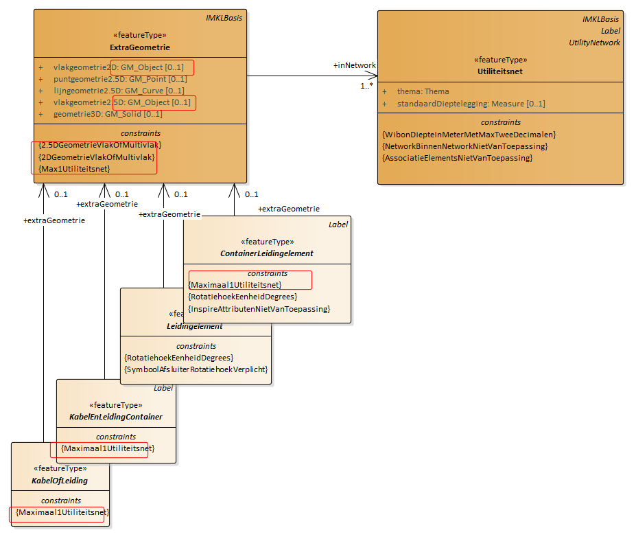

Data content en structuur
=========================

Dit hoofdstuk beschrijft het datamodel van utiliteitsnetten. Aan de hand van UML
klasse diagrammen wordt het model beschreven.

Inleiding.
----------

In de volgende paragrafen wordt de inhoud en structuur van het IMKL beschreven
middels UML diagrammen en een bijbehorende objectcatalogus.

De verschillende uitwisselprocessen WIBON, Buisleidingen voor Risicoregister en
Stedelijk water worden in aparte paragrafen behandeld. Dit resulteert in vier
deelmodellen respectievelijk benoemd als: IMKL – WIBON;

IMKL – Buisleidingen Risicoregister;

IMKL – Stedelijk water.

De WIBON toepassing wordt als eerste beschreven. Omdat de andere toepassingen
ook delen daarvan gebruiken is het nodig om dit model integraal door te nemen.

Het eerste gedeelte van dit hoofdstuk bevat de UML diagrammen van alle
deelmodellen. Schematisch is opgenomen wat de informatie-inhoud is middels
objecten, hun attributen, datatypen, relaties tussen objecten met alle detail
dat nodig is voor een eenduidige beschrijving. Van elk deelmodel is een compleet
diagram opgenomen waarna in verschillende subparagrafen elke keer een deel in
een apart diagram wordt toegelicht. Sommige onderwerpen hebben een aparte
toelichting nodig deze worden in de titel aangeduid met ‘Extra toelichting’.

Het tweede gedeelte bevat de objectcatalogus met in tabelvorm dezelfde
informatie als de diagrammen maar nu middels taal beschreven. Alle
informatie-elementen zijn daarbij voorzien van definities en indien nodig een
toelichtende beschrijving. De objectcatalogus bevat de gezamenlijke
informatie-inhoud van alle deelmodellen.

UML diagrammen.
---------------

### Beschrijving algemeen principe: IMKL als extensie op INSPIRE.

IMKL is gemodelleerd als een extensie op het model voor het INSPIRE thema
Utility and Governmental Services. Binnen dat INSPIRE thema zijn alleen de
modellen voor utiliteitsnetten (utility networks) van belang voor IMKL. IMKL
neemt de hele inhoud over van de INSPIRE specificatie en voegt daar de
specifieke informatie aan toe die nodig is voor realisatie van de in de scope
genoemde processen. Met IMKL kan daardoor een dataset geleverd worden of
dataservice worden ingericht die INSPIRE conform is en voorziet in het detail
van de eisen van de genoemde processen. Er is hierbij opgemerkt dat IMKL als een
modelmatige extensie van de INSPIRE niet betekent dat de in IMKL geleverde data
automatisch INSPIRE data zijn. Dit geldt zeker voor thema’s die niet
INSPIRE-plichtig zijn.

Het volgende diagram geeft de relatie tussen de verschillende modellen. IMKL is
een uitbreiding op het INSPIRE Utility Networks model waarin voor de netten
elektriciteit, olie-gas-chemicalien, afvalwater, telecomunicatie, warmte en
drinkwater aparte modellen zijn opgenomen. Deze modellen zijn toepassingen van
het INSPIRE netwerkmodel waarin opgenomen een model voor topologie. Het
netwerkmodel is onderdeel van het INSPIRE Generic Conceptual Model,
basismodellen en basistypen die generiek zijn voor alle INSPIRE thema modellen.
IMKL is een apart pakket met bijbehorende namespace dat gebruik maakt van de
door INSPIRE beheerde pakketten. Een namespace is daarbij gedefinieerd als een
unieke aanduiding voor het domein waarbinnen de informatie-elementen
gedefinieerd zijn. In IMKL zijn afspraken gemaakt over te gebruiken namespaces
en afkortingen hiervoor. De namespace voor IMKL is ‘IMKL’.

Figuur 5.1: Een UML package diagram van de relatie tussen IMKL en de INSPIRE
dataspecificaties. Elk pakket bevat de informatie die op dat niveau wordt
toegevoegd. Het pakket IMKL is een extensie op het INSPIRE model voor Utility
Networks. INSPIRE utilities heeft afhankelijkheden met het INSPIRE algemene
netwerkmodel en INSPIRE basistypen. IMKL omvat het totaal van de aan elkaar
gerelateerde pakketten.

### Metamodel.

IMKL gebruikt voor het beschrijven van de uitbreiding op INSPIRE het zelfde
metamodel voor UML als INSPIRE: het metamodel beschreven in het INSPIRE Generic
Conceptual Model. IMKL wijkt hiermee af van de Nederlandse Standaard voor
informatiemodellering MIM.

De volgende argumenten ondersteunen de keuze voor het INSPIRE metamodel:

\- IMKL is als extensie gemodelleerd op het INSPIRE model. De combinatie van
twee metamodellen maakt de beschrijving van de extensie onnodig complex;

\- Het metamodel van INSPIRE kunnen we niet aanpassen omdat dit in Europees
verband is vastgesteld.

De volgende stereotypen worden gebruikt als onderdeel van het UML profiel.

| **Stereotype**    | **Model element**           | **Beschrijving**                                                                                                               |
|-------------------|-----------------------------|--------------------------------------------------------------------------------------------------------------------------------|
| applicationSchema | Package                     | Een applicatie schema volgens ISO 19109 en NEN 3610.                                                                           |
| featureType       | Class                       | Een geografisch object.                                                                                                        |
| dataType          | Class                       | Een gestructureerd data type zonder identiteit.                                                                                |
| union             | Class                       | Een gestructureerd data type zonder identiteit waarvan precies één van de attributen aanwezig is in een instantie.             |
| enumeration       | Class                       | Gesloten lijst van domeinwaarden.                                                                                              |
| codeList          | Class                       | Open lijst van domeinwaarden                                                                                                   |
| voidable          | Attribute, association role | Om aan te geven dat het attribuut of associatierol een nullwaarde kan hebben. Een reden waarom het attribuut niet ingevuld is. |

### UML - WIBON overzicht.

Het onderstaand UML diagram bevat het complete IMKL – WIBON inclusief de relatie
met INSPIRE Utilities. In de hierop volgende paragrafen wordt telkens een deel
van het diagram toegelicht.

Kleurgebruik in diagrammen:

-   Oranje: IMKL objecttypen.

-   Rood: INSPIRE Utility Networks per type kabel of leiding

-   Groen en grijs: INSPIRE Utility Networks algemeen

-   Licht oranje en grijs: Niet-instantieerbare objecttypen, datatypen en
    waardelijsten.

-   In de diagrammen zijn de wijzigingen ten opzichte van de IMKL 1.2.1 versie
    met rode kaders aangegeven.

>   Voorbeeld: cardinaliteit aangepast en constraint toegevoegd:

Voor WIBON geldt dat er een verschil is tussen het dataverkeer tussen de
centrale voorziening en de afnemers, de uitlevering, en het dataverkeer tussen
de netbeheerders en de centrale voorziening, de aanlevering. Bij de
netbeheerders geldt vervolgens dat er een verschil is tussen de centraal
aangesloten netbeheerders en de decentraal aangesloten netbeheerders. Deze
verschillende zijn in de diagrammen aangegeven.

-   Rood omlijnd: gegevens die door de centrale voorziening worden gegenereerd.
    Komen alleen voor in uitlevering.

-   Groen omlijnd: gegevens die voor de centraal aangesloten netbeheerder door
    de voorziening wordt gegenereerd. Decentraal aangesloten netbeheerders
    moeten deze gegevens per melding aan de centrale voorziening leveren.

-   Bij objecttypen is met constraints aangegeven indien er verschil is met
    betrekking tot aan- of uitlevering of een decentraal of centraal aangesloten
    netbeheerder.

Toelichting bij het diagram.

Het UML diagram brengt het IMKL – WIBON voor netinformatie inclusief de relatie
met INSPIRE in beeld. De specifiek voor de andere deelmodellen opgenomen
informatie zit hier nog niet in. Ook de WIBON gebiedsinformatie, graafpolygoon
en belangenregistratie zijn niet opgenomen (zie daarvoor paragraaf 5.2.25). Voor
de leesbaarheid zijn een aantal relaties niet opgenomen. In de detaildiagrammen
komen die wel terug. Met omlijningen zijn onderdelen van het diagram benoemd:
IMKL en INSPIRE Generic Network Model. Aan de bovenzijde bevindt zich de IMKL
toevoeging op het INSPIRE Utilities model. Aan de onderzijde het INSPIRE
Utilities model. De koppelingslaag is via de IMKL objecttypen die zich in het
midden bevinden: Elektriciteitskabel, Telecommunicatiekabel, Waterleiding tot en
met Kast. Deze objecttypen zijn 1 op 1 gerelateerd aan de overeenkomstige
objecttypen uit INSPIRE Utilities. IMKL:Elektricteitskabel aan
INSPIRE:ElectricityCable, IMKL:Waterleiding aan INSPIRE:WaterPipe enz. Ze
bevatten daarmee alle INSPIRE eigenschappen en relaties van die objecttypen. De
IMKL koppelingslaag is ook gekoppeld aan de IMKL inhoudelijke informatie. Deze
is gemodelleerd in de objecttypen KabelOfLeiding, Leidingelement en de
containerversies van beide.

De objecttypen in de IMKL koppelingslaag (Elektricteitskabel, Waterleiding enz)
vormen de centrale objecten in een IMKL dataset. Via overerving en relaties
worden alle eigenschappen toegevoegd, hetzij van de INSPIRE zijde van het model,
hetzij van de IMKL zijde van het model. Als voorbeeld het attribuut geometrie
van een waterleiding. Deze is gedefinieerd als centreLineGeometry bij het
objecttype Link uit het Generic Network Model. Via UtilityLinkSet wordt dat
overgeërfd door het objecttype Pipe, vervolgens doorgegeven aan WaterPipe
waardoor het bij de IMKL waterleiding komt. Een ander voorbeeld is het attribuut
UtilityDeliveryType bij het INSPIRE objecttype UtilityLinkSet. Overerving is
door alle kabel-, buis- en ducttypen.

### Associaties in het model.

In het model zijn associaties opgenomen om de relatie tussen objecttypen te
benoemen. In het IMKL gedeelte zijn regels opgenomen voor het bepalen van de
richting waarin de associaties zijn bepaald.

-   Elke associatie wijst één kant op. Er zijn dus geen inverse associaties. Als
    er een verwijzing naar beide kanten nodig is worden er twee associaties
    opgenomen;

-   elk objecttype in IMKL verwijst direct naar het utiliteitsnet waar het bij
    hoort. Dit gebeurt in alle gevallen met een associatierol genaamd inNetwork.
    Dat geldt ook voor objecttypen als Annotatie, Maatvoering, Bijlage en
    dergelijke. Informatie technisch is het mogelijk dat sommige objecttypen bij
    meerdere utiliteitsnetten horen, bijvoorbeeld een door verschillende netten
    gedeelde mantelbuis, of een dieptemarkering. De associatierol inNetwork is
    daarom 1..\*. Echter vanuit operationeel punt bezien is dat niet wenselijk.
    Met een constraint (‘Max1Utiliteitsnet’) is daarom in alle gevallen het
    maximaal aantal utiliteitsnetten waarnaar verwezen kan worden beperkt tot 1.

-   voor netwerkelementen geldt dat associaties verwijzen naar de objecten
    ExtraInformatie en Diepte die er bij horen en niet andersom.

### Numerieke waarden.

Numerieke waarden bij attributen worden opgenomen conform de bij het attribuut
opgegeven eenheid en nauwkeurigheid. Indien de waarde als label is opgenomen en
dus een alfanumeriek datatype heeft geldt de komma als decimaal scheidingsteken.
Voor de in specifieke datatypen gedefinieerde waarden geldt een punt als het
afgesproken decimaal scheidingsteken. De specifieke datatypen voor waarden zoals
Measure bestaan uit een combinatie van een waarde en een eenheid.

### Waardelijsten zijn extern.

De opgenomen waardelijsten van het type \<\<codeList\>\> worden niet in het UML
beheerd maar in externe waardelijsten. Zij worden gepubliceerd in een
waardelijstregister. Ze maken wel onderdeel uit van IMKL maar omdat ze
dynamischer zijn voor wat betreft het inhoudelijk beheer zijn ze uit de UML
beschrijving gehaald. Om het model toch leesbaar te houden zijn de startversies
van die lijsten wel opgenomen in de UML diagrammen. Voor operationele toepassing
is echter het waardelijstregister leidend.

### Basisattributen voor identificatie en labels.

Identificatie: Alle concrete objecttypen en daarmee objecten in een dataset
hebben een attribuut voor identificatie. Met deze identificatie kunnen ze uniek
geïdentificeerd worden. INSPIRE gebruikt hiervoor het attribuut identifier met
het datatype Identifier. Veel objecttypen uit IMKL overerven die attributen.
Voor objecttypen die specifiek voor IMKL zijn gecreëerd en die niet via een
generalisatie aan INSPIRE zijn gekoppeld is er een attribuut identificatie met
het datatype NEN3610ID. Zie ook paragraaf 5.2.25 Identifier management.

Label: Label is een abstract datatype dat is gecreëerd om middels overerving aan
bijna alle objecten een mogelijkheid voor het toekennen van een label te bieden.
Merk op dat voor annotatie en maatvoering (ExtraInformatie) en diepte,
bijbehorende labels via het object Label doorgegeven worden. Het af te beelden
label (getal of tekst) wordt opgenomen bij het attribuut label. Vanuit praktisch
punt is het maximaal aantal karakters van een label op 40 gezet. In het
attribuut omschrijving kan een betekenis worden opgenomen. Bij de subklassen
Maatvoering, Annotatie en Diepte is het plaatsingspunt van een label bepaald met
een attribuut ligging. Bij andere subklassen, bijvoorbeeld de netelementen wordt
de plaatsing van een eventueel label in een viewer bepaald.

**Voidable:** Bij attributen en associaties die het stereotype \<\<voidable\>\>
hebben kan, indien het van toepassing is, geen waarde worden ingevuld. Optioneel
kan er ook een reden opgenomen worden waarom er geen waarde is ingevuld. De
benoemde redenen zijn:

**Unknown:** Waarde onbekend: De waarde is bij de zender niet bekend.

**Unpopulated:** Niet ondersteund: De zender houdt in zijn registratie geen
waarde voor dit attribuut bij. Geldt voor alle objecten van dit objecttype.

**Withheld:** Niet geautoriseerd: De zender vindt dat de ontvanger niet
geautoriseerd is om de waarde te

Kennen. Waarde is vertrouwelijk en wordt niet uitgewisseld.

Figuur 5.2: Basistypen van het model: Identificatie en label. Alle objecttypen
hebben verplicht een identifier. Bijna alle objecten hebben optioneel een label.

LifespanVersion: In de basistypen van het model zitten twee attributen voor een
temporeel model: beginLifesepanVersion en endLifespanVersion. INSPIRE kent die
attributen ook en past die toe bij het objecttype NetwerkElement. In IMKLBasis
zijn ze toegevoegd voor die objecttypen die niet van INSPIRE overerven.
beginLifespanVersion is daarin de begindatum waarop deze versie van een data
object in de registratie werd aangemaakt of veranderd; het begin van de
levenscyclus van deze versie van een data object. endLifespanVersion is de datum
die het einde van een levenscyclus van deze versie van een data object aangeeft;
het moment vanaf wanneer het geen onderdeel meer is van de actuele registratie.
Zie ook paragraaf 5.2.27 Tijd representatie en temporeel model.

### IMKL semantische kern.

De kern van het IMKL model bevat de semantiek van de extra informatie voor de
Nederlandse gebruikstoepassingen. Alleen de objecttypen die de inhoudelijke IMKL
informatie bevatten en die extra aan het INSPIRE Utility networks model zijn
toegevoegd zijn afgebeeld. Bijvoorbeeld geometrie en netwerktopologie zitten in
INSPIRE Utility networks en zijn niet afgebeeld.

Figuur 5.3: IMKL semantische kern voor WIBON toepassing. Een utiliteitsnet
bestaat uit elementen. De elementen hebben attributen en een link met extra
informatie.

Toelichting bij het diagram: Een Utiliteitsnet bestaat uit objecten
KabelOfLeiding, Leidingelement, KabelEnLeidingContainer en
ContainerLeidingelement. Via het associatie attribuut inNetwork worden deze
gerefereerd aan één Utiliteitsnet van één thema. Deze associatie is alleen
zichtbaar bij ContainerLeidingelement. De andere netwerkobjecten hebben die
associatie via het INSPIRE Netwerk model. Alle objecten hebben kenmerken. De
objecttypen kunnen uitgebreid worden met ExtraInformatie. Dit kan annotatie,
maatvoering en/of extra bestanden zijn. Al deze typen vallen onder de
superklasse ExtraInformatie en worden vanuit de andere objecten gerefereerd via
het attribuut heeftExtraInformatie. Omdat alle elementen van en in een
Utiliteitsnet middels het associatie attribuut inNetwork refereren aan het
Utiliteitsnet is typering van alle elementen mogelijk op waarden van het
attribuut thema. Alle elementen kunnen daarmee per thema geselecteerd worden.

**Maximaal 1 utiliteitsnet per netelement.**

ContainerLeidingelementen en KabelEnLeidingContainers (Kabelbed, Mantelbuis en
Duct) kunnen in de werkelijkheid bij meerdere utiliteitsnetten geregistreerd
zijn. Dat geldt dan natuurlijk ook voor objecten die daaraan zijn geassocieerd,
zoals ExtraInformatie en Diepte. Het IMKL model dwingt met een aparte constraint
(Max1Utiliteitsnet) af dat in de datauitwisseling een netelement altijd naar
maximaal 1 utiliteitsnet kan verwijzen. Het kan daarmee voorkomen dat in een
totaalset van een WIBON uitlevering elementen dubbel zijn opgenomen.
Bijvoorbeeld een gedeelde mantelbuis komt zowel in het telecomnet als in het
waternet voor.

Een Utiliteitsnet wordt gerefereerd door een Belanghebbende, deze heeft een
belang in een WIBON aanvraag. De Belanghebbende kan verwijzen naar een object
EigenTopografie voor het koppelen van een extra toegevoegde topografie.

**Extra toelichting: ExtraDetailinfo, maatvoering, annotatie.**

Een utiliteitsnet of individuele netelementen kunnen via het attribuut
heeftExtraInformatie verwijzen naar extra informatie van toepassing op dat
element. Extra informatie kan in de vorm een gekoppeld bestand, maatvoering,
annotatie of een eis voorzorgsmaatregel.

Annotatie:

Pijlen, lijnen en labels die als annotatie op een kaartbeeld staan en niet als
maatvoering gelden worden met het object Annotatie opgenomen. Met het attribuut
ligging wordt de geometrie van de annotatie aangegeven of de plaatsingspunt van
het label. De tekst en eventueel betekenis van het label worden via het object
Label opgenomen.

Het uitwisselen van annotatie gebeurt alleen daar waar de bronhouder het nodig
vindt om deze informatie als annotatie op te nemen. Annotatie objecten zijn
zelfstandige objecten die middels een associatie aan een Utiliteitsnet zijn
verbonden en optioneel ook gerefereerd worden door het netelement waar ze
betrekking op hebben. Annotatie bevat in veel gevallen de informatie die ook bij
de netelementen zelf opgenomen kan worden maar in de bronbestanden niet als
gekoppelde informatie is opgenomen. De verwachting is dat het gebruik van
annotatie als bron van informatie in de toekomst afneemt en de object gekoppelde
en opvraagbare informatie toeneemt.

ExtraDetailinfo:

Extra detailinformatie in de vorm van bestanden kan optioneel aan een
utiliteitsnet of netelement worden gekoppeld via het attribuut
heeftExtraInformatie. Bestanden kunnen verschillende typen informatie
beschrijven zoals een aansluiting, huisaansluiting of een profielschets met een
lengte- of dwarsprofiel (zie ook 5.2.12). Het bestandstype moet worden
gespecificeerd en is in alle gevallen pdf.

Met het verplichte attribuut ligging wordt de locatie aangegeven waar de
detailinformatie van toepassing is. In een viewer kan die locatie dan
gevisualiseerd worden.

Maatvoering:

Maatvoering wordt gebruikt om de positie van een netwerkelement ten opzichte van
aanwezige bebouwing weer te geven. Als maatvoering is opgenomen dan zijn die
gegevens leidend irt de afstanden die uit de coördinaten berekend kunnen worden.
De annotatietypen voor maatvoering zijn: maatvoeringshulplijn, maatvoeringslijn,
maatvoeringspijl, maatvoeringspijlpunt of maatvoeringslabel. Een
maatvoeringspijlpunt wordt middels een puntsymbool uitgewisseld.

| **Waarde**   | **maatvoeringshulplijn**                                                                             |
|--------------|------------------------------------------------------------------------------------------------------|
| Omschrijving | Lijn om een hulplijn in een maatvoering te visualiseren                                              |
| **Waarde**   | **maatvoeringslijn**                                                                                 |
| Omschrijving | Lijn om een lijn in een maatvoering te visualiseren                                                  |
| **Waarde**   | **maatvoeringslabel**                                                                                |
| Omschrijving | Punt en label om een label in een maatvoering te visualiseren                                        |
| **Waarde**   | **maatvoeringspijlpunt**                                                                             |
| Omschrijving | Punt om een pijlpunt in een maatvoering te visualiseren. Is een punt met een bijbehorend puntsymbool |
| **Waarde**   | **maatvoeringspijl**                                                                                 |
| Omschrijving | Lijn met aan beide kanten een pijlpunt                                                               |

Elke maatvoeringslijn wordt een apart object.

Het maatvoeringslabel geeft met een label attribuut het label aan dat als
maatvoeringsgetal wordt afgebeeld. Bijvoorbeeld ‘25’. Overeenkomstig NEN 3116 is
de eenheid meter en de gebruikelijke nauwkeurigheid is 0,1. Het decimale
scheidingsteken is een komma. Het attribuut label wordt via het object
ExtraInformatie overerft van het object Label. In het attribuut omschrijving van
het object Label kan indien nodig een nadere omschrijving worden opgenomen, zie
figuur 5.2. De locatie van het label en de geometrie van de maatvoeringslijnen
wordt met het attribuut ligging opgenomen. Maatvoering is direct gekoppeld aan
een Utiliteitsnet. Hierdoor kan middels het thema attribuut van Utiliteitsnet de
maatvoering per thema worden geselecteerd.

**Extra toelichting: Eis voorzorgsmaatregel en Bijlage.**

Een eis voorzorgsmaatregel geeft aan dat de beheerder van een net aangegeven
heeft dat er sprake is van voorzorgsmaatregelen die getroffen dienen te worden.
Dit betreft alleen de wettelijk geregelde eis voorzorgsmaatregel. Bij een WIBON
uitlevering wordt – per thema - de voorzorgsmaatregel met de hoogste prioriteit
bijgesloten middels een gekoppeld separaat bestand beschreven in
EisVoorzorgsmaatregelBijlage. Van deze bijlage wordt vastgelegd op welk thema
deze betrekking heeft en de te nemen eis voorzorgsmaatregel. De bijlage behoort
bij een Belanghebbende netbeheerder. Op het niveau van de individuele
netelementen is de eis voorzorgsmaatregel aangegeven via een object
AanduidingEisVoorzorgsmaatregel. In dat geval is het netelement en of de locatie
aangegeven waar een voorzorgsmaatregel geldt.

Standaard wordt de geometrie van het object AanduidingEisVoorzorgsmaatregel
gebruikt om aan te geven op welke kabel of leiding of deel daarvan een
voorzorgsmaatregel van toepassing is. De begrenzing van de geometrie is dan om
dit te visualiseren en eenvoudig ruimtelijke selecteerbaar te maken.

De aanduiding van een eis voorzorgsmaatregel is functioneel gerelateerd aan een
kabel of leiding maar een directe informatiekundige associatie tussen een kabel
of leiding en de AanduidingEisVoorzorgsmaatregel is niet verplicht. De
strookbreedte die de netbeheerder voor het betreffende object wil hanteren wordt
door de netbeheerder als vlakgeometrie aangeleverd bij de aanduiding eis
voorzorgsmaatregel.

De toepassing van eis voorzorgsmaatregelen en het gebied waarop deze betrekking
heeft, is een verantwoordelijkheid van de netbeheerder en wordt door de
netbeheerder zelf bepaald.

Voor de geometrie van aanduidingen eis voorzorgsmaatregel zijn ook multivlakken
toegestaan.

Naast de bijlage voor de eis voorzorgsmaatregel is er in het IMKL ook nog een
mogelijkheid om als netbeheerder een algemene bijlage mee te leveren bij de
gebiedsinformatielevering.

In het kader van de reductie van het aantal bijlagen, wordt aangemoedigd om deze
algemene informatie als URL beschikbaar te stellen (attribuut websiteKLIC).

**Extra toelichting: EigenTopografie.**

Indien er extra topografie nodig is om de positie van netwerkelementen nader aan
te geven kan dit middels het object EigenTopografie. Er kan een bestaande of
plan topografie worden meegegeven. Met het attribuut ligging wordt de geometrie
van de EigenTopografie opgenomen. De eigen topografie wordt altijd
gevectoriseerd aangeleverd. De topografische elementen worden getypeerd conform
een typeringslijst, TopografischObjectTypeValue, gebaseerd op IMGeo. Hiermee is
het type topografisch object omschreven en is een koppeling met
visualisatieregels mogelijk.

**Extra toelichting: Geometrie en topologie.**

**2D geometrie:**

Het verplichte geometrieprofiel van IMKL is 2D. Primair bestaat de geometrie uit
punten en lijnen die het netwerk representeren. 2D vlakken zijn additioneel
waarbij ook multivlakken zijn toegestaan. 2,5 D en 3D zijn een additionele
extensie.

Figuur 5.4: Geometriemodel. Primair en verplicht punten en (hart)lijnen.
Optioneel vlakken en additioneel 3D.

De geometrie van de netwerkelementen wordt overgeërfd uit het Inspire Netwerk
model. Alle netwerkelementen zijn onderdeel van een topologisch netwerk en
worden geometrisch beschreven door links of nodes. De geometrieën zijn verplicht
punten of lijnen. Lijnen kunnen opgebouwd zijn uit meerdere lijnsegmenten. De
lijnen en punten zijn niet schematisch (niet ‘fictitious’) en representeren de
locatie van de netwerkelementen middels hartlijnen. Lijnen van leidingen en
punten van bijbehorende leidingelementen hoeven niet noodzakelijkerwijs aan te
sluiten. De connectiviteit wordt gerealiseerd door de arc-node topologie. Als
voorbeeld een pompstation in een rioolnetwerk. Het door een (center) punt
gerepresenteerde pompstation is niet verbonden met leidingen. Er lopen wel
leidingen naar de punt toe maar niet tot aan de punt. De leidingen hebben wel
een verwijzing naar de node (connectiviteit).

Additioneel en optioneel kan een netwerkelement ook nog een vlak als geometrie
hebben, een verwijzing naar een object ExtraGeometrie middels een attribuut
extraGeometrie. Indien het pompstation ook nog door een vlak wordt
gerepresenteerd lopen de leidingen in de regel wel tot aan de begrenzing van het
vlak.

Lijnen zijn in het INSPIRE netwerkmodel gemodelleerd als een LinkSet die bestaat
uit een verzameling van 1 of meer GeneralisedLinks. Dit kunnen Links zijn van
het type Curve of een LinkSequence, een geordende verzameling DirectedLinks. De
LinkSequence kan worden toegepast als er een route, met een richting,
uitgewisseld moet worden. Voor IMKL is dit niet relevant en wordt de
LinkSequence derhalve niet toegepast

Meervoudig gebruik van geometrieën is niet toegestaan.

In principe staat het INSPIRE model toe dat een link door meerdere
netwerkelementen wordt gebruikt. In de IMKL uitwisseling is dat echter niet
toegestaan. Elke link wordt maar door één netwerkelement gebruikt.

Referentiestelsel.

Referentiestelsel voor IMKL datalevering is Rijksdriehoekmeting (RD), zie
hoofdstuk 6.

**3D geometrie.**

IMKL voorziet in een verplicht gebruik van 2D geometrieën. Middels de diepte
informatie kan de positie in het verticale vlak worden uitgewisseld. Om ook het
opnemen van volledige 3D liggingsgegevens mogelijk te maken is er een optioneel
en additioneel 3D model toegevoegd. De 3D liggingsgegevens van kabels en
leidingen zijn bijvoorbeeld relevant bij gestuurde boringen. Bij een gestuurde
boring is de derde dimensie (=z) nodig om de boring te sturen, om het
uittredepunt goed te benaderen en om botsingen met andere infrastructuur te
voorkomen. Daardoor is na de boring de 3D ligging van de boring in 3D bekend.
Ook voor andere kabels en leidingen die tegenwoordig worden aangelegd, is steeds
vaker de 3D ligging bekend. Het niet accommoderen van deze 3D informatie in IMKL
zou in feite betekenen dat relevante informatie wordt weggegooid.

Voor veel situaties is 2D data echter (nog) voldoende. Bovendien is voor veel
kabels en leidingen de 3D (=diepte) ligging niet bekend en door “zweven” van
sommige typen kabels en leidingen is de 3D (maar ook 2D ligging) niet altijd
absoluut. 3D geometrie kan daarbij een verkeerde indruk geven van de precisie.

In IMKL is de mogelijkheid opgenomen om objecten in 3 dimensies (3D) te
modelleren. Deze mogelijkheid is optioneel en is naast, niet in plaats van, 2D
aanwezig. Dat betekent dat de basis uitgaat van een (volledige) 2D data set.
Daarnaast kan, in dezelfde data set, 3D geometrie voor een of meerdere van de
objecten aanwezig zijn.

Figuur 5.5: Alle netelementen kunnen naast de verplichte punten en centerlijnen
optioneel een extra geometrie hebben van het type 2D, 2,5D of 3D.

KabelOfLeiding, KabelEnLeidingContainer, Leidingelement en
ContainerLeidingelement bieden ieder de mogelijkheid voor het opnemen van 3D
geometrie in twee verschillende ‘Levels of Detail’ (LOD). Allereerst kunnen 2.5D
punten, vlakken en lijnen worden opgenomen. Dit kan beschouwd worden als Level
of Detail 0 (LOD0) en is bedoeld voor het toevoegen van de z coördinaat. Elk
IMKL vlak, lijn- of puntobject krijgt voor elk coördinatenpaar een z waarde. Om
de ligging in 3D te beschrijven krijgt de lijn extra coördinatenparen ten
opzichte van de 2D representatie. De objecten kunnen dan in een Digitaal Terrein
Model (3D terreinmodel) worden geïntegreerd en op de juiste hoogte onder of
boven maaiveldniveau worden gerepresenteerd.

Daarnaast is het mogelijk om volledige 3D geometrie op te nemen. Dit is te
beschouwen als Level of Detail 1 (LOD1) en maakt het mogelijk om IMKL objecten
als volledige 3D objecten (volumes) te representeren. Zie Figuur voor
voorbeelden van een IMKL object op verschillende levels of detail.

Voor 3D IMKL wordt het ruimtelijk Referentie systeem EPSG:7415 gehanteerd. Dit
is een samengesteld referentiesysteem met RD voor de XY-dimensie (EPSG:28992) en
NAP voor de Z dimensie (EPSG:5709). Zie ook hoofdstuk 6.

Figuur 5.6: Leidingobject in 2.5D en 3D

### Diepte.

Diepte bevat informatie over de dieptelegging van netwerkelementen. Het is een
uitvoerige beschrijving die diepte tov het lokale maaiveld beschrijft of dieptes
tov NAP. Beide hebben een apart objecttype, respectievelijk DiepteTovMaaiveld en
DiepteNAP. Het cijfer dat bij de diepte hoort wordt opgenomen bij het attribuut
dieptepeil. Het betreft de afstand vanaf de referentie tot aan de *bovenkant*
van een object KabelOfleiding, KabelEnLeidingContainer, Leidingelement of
Containerleidinglelement. Het attribuut diepteAangrijpingspunt geeft het
aangrijpingspunt van het element weer dat geldt als punt van meting. Standaard
wordt daar bovenkant ingevuld maar het kan zinvol zijn om bij een buis
(riolering) *additioneel* ook de binnenonderkant buis (BOB) als meetpunt op te
nemen (zie ook Gegevenswoordenboek Stedelijk Water:
<https://data.gwsw.nl/totaal/binnenonderkantbuis/>). Het datatype van dieptepeil
is ‘Measure’ waarbij de meeteenheid apart wordt gespecificeerd. Voor WIBON wordt
er altijd meters gebruikt met maximaal 2 decimalen.

Er is informatie over de nauwkeurigheid waarmee de diepte is opgenomen. Dit is
de nauwkeurigheid van de meting op de dag van de legging of het moment van een
revisie van deze informatie. Daarvoor zijn 4 nauwkeurigheidsklassen opgenomen.
De nauwkeurigheid moet minstens +- 1 meter zijn. Bij het utiliteitsnet is een
attribuut standaardDieptelegging opgenomen, die is daarmee expliciet gemaakt.

Eén leiding kan meerdere dieptegegevens langs het traject van de leiding hebben.
Omdat hierdoor de diepte informatie en het object leiding niet meer 1 op 1 aan
elkaar gekoppeld zijn kan via het attribuut ligging de locatie van het
dieptegegeven worden aangegeven. De diepte geldt op die locatie. Een object
Diepte heeft ook de attributen van het object Label. Hiermee kunnen
verschillende dieptes middels annotatie aan één leiding worden gekoppeld.

Indien de dieptegegevens niet aan een netelement te koppelen zijn omdat die
koppeling bij de bronregistratie niet aanwezig is, zijn de dieptegegevens direct
aan het utiliteitsnet gekoppeld.

Figuur 5.7: Dieptegegevens zijn gemodelleerd als aparte objecten waarin diepte
ten opzicht van maaiveld en of NAP is opgenomen. Standaard dieptelegging wordt
opgenomen bij het Utiliteitsnet, afwijking daarvan bij de netelementen.

### Utiliteitsnet.

Definitie: Een verzameling netwerkelementen die tot één type
nutsvoorzieningennet behoren.

Bron: INSPIRE

Een Utiliteitsnet (nutsvoorzieningnetwerk, utiliteitsnetwerk, netwerk of net) is
de IMKL versie van het INSPIRE UtilityNetwork. Een Utiliteitsnet bevat geen
eigen geometrie maar is de samenstelling van alle gerefereerde netwerkelementen.
Het associatie attribuut elements realiseert deze verwijzing. Deze elements
associatie wordt echter niet gebruikt omdat de inverse associatie inNetwork de
associatie al realiseert. Alle netwerkelementen van een Utiliteitsnet vallen
onder het thema dat bij het utiliteitsnet hoort en worden daar ook door
getypeerd. Dat wil zeggen dat bijvoorbeeld een kathodische bescherming voor een
waterleiding valt onder een utiliteitsnet met het thema laagspanning. Via
INSPIRE UtilityNetwork worden attributen voor netwerktype en verantwoordelijke
partijen gekoppeld. Utiliteitsnet bevat extra attributen voor thema en
standaardDieptelegging. Door de referentie vanuit de Belanghebbende is de
verantwoordelijke netbeheerder gekoppeld. Annotatie, maatvoering en mogelijk
extra detailinfo worden gekoppeld en gelden voor het hele net (of deel daarvan
in een bestand).

Figuur 5.8: Utiliteitsnet is getypeerd naar thema en wordt voor WIBON
gerefereerd door een Belanghebbende. Utiliteitsnet is een verbijzondering van
INSPIRE UtilityNetwork.

In INSPIRE is er voor UtilityNetwork met het attribuut utilityFacilityReference
een referentie mogelijk naar een ActivityComplex. Hiermee kan gerefereerd worden
aan grote utiliteitsnetonderdelen zoals bijvoorbeeld een energiecentrale een
waterzuiveringscentrale, een overslagstation. Het huidige IMKL ondersteunt
echter niet de opname van het objecttype ActivityComplex en evenmin het
attribuut utilityFacilityReference.

### KabelOfLeiding.

Definitie: Leidingen, buizen of kabels bestemd voor voortgeleiding van energie,
materie of data.

Bron: IMKL

KabelOfLeiding is de verzamelklasse voor alle kabel en leiding typen per type
net (per ‘thema’). In het INSPIRE Utility networks model zijn de kabel- en
leidingtypen apart benoemd, de telecomkabel, de elektriciteitskabel enz.

Detailverwijzingen, annotatie en maatvoering zijn gekoppeld via het
associatie-attribuut heeftExtraInformatie. Informatie over een mogelijke
voorzorgsmaatregel bij graven is via verwijzing naar een object
AanduidingEisVoorzorgsmaatregel. Deze kan voor een geheel of een deel van kabel
of leiding gelden. De tekst van de voorzorgsmaatregel is bij het object
AanduidingEisVoorzorgsmaatregel opgenomen.

KabelOfLeiding zijn individuele kabels en of leidingen. Ze zijn dus niet een
verzameling. Voor dat laatste wordt de klasse KabelEnLeidingContainer gebruikt
en specifiek het object Kabelbed.

De nauwkeurigheid van de liggingsgegevens in het horizontale vlak wordt
aangegeven met een nauwkeurigheidXYvalue. Dit kan in een drietal klassen: tot 30
cm, tot 50 cm, tot 100 cm In IMKL is de minimale nauwkeurigheid +- 1 meter.

Kabel of leidingen hebben verplicht een lijngeometrie. Optioneel is er via het
associatie-attribuut extraGeometrie een buitenbegrenzing of contour van het
object op te nemen. De netbeheerder bepaalt zelf wanneer dat functioneel is.

Figuur 5.9: KabelOfLeiding bevat de gemeenschappelijke informatie voor kabels en
leidingen.

### Leidingelement.

Definitie: Een object dat bij één of meerdere leidingen behoort en als node in
het netwerkmodel is opgenomen.

Bron: IMKL

Toelichting: Bijvoorbeeld objecten zoals een schakelkast, verdeelkast, kranen,
afsluiters, versterkers, kabelmof, rioolput, (druk)rioolgemaal, kathodische
bescherming, boorput, etc.

Een leidingelement kan zowel betrekking hebben op ondergrondse als op
bovengrondse delen van het net.

Leidingelement is de verzamelklasse voor alle typen leidingelementen. De typen
zijn niet als apart objecttype opgenomen maar als verzamelklasse Appurtenance.
In INSPIRE zijn de Appurtenances met een appurtenanceType attribuut verder
getypeerd. Deze typering kan nog verder uitgebreid worden. In bijlage 1 van dit
document zijn de waarden voor AppurtenanceTypeValue opgenomen.

Figuur 5.10: Leidingelement bevat de gemeenschappelijke eigenschappen van alle
typen leidingelementen.

De geometrie van een Leidingelement is verplicht altijd een punt. Optioneel is
er via het associatie-attribuut extraGeometrie een buitenbegrenzing of contour
van het object op te nemen. De netbeheerder bepaalt zelf wanneer dat functioneel
is. Leidingen die aan een Leidingelement verbonden zijn hoeven niet tot aan de
puntrepresentatie door te lopen. Ze kunnen stoppen bij de buitengrens van het
element (ook als de contour niet is opgenomen), dat doen ze in werkelijkheid
immers ook. Met de Arc/Node topologie kan wel opgenomen worden dat de leiding
bij het leidingelement hoort.

Informatie over een eventuele eis voorzorgsmaatregel is middels een associatie
vanuit het object AanduidingEisVoorzorgsmaatregel gekoppeld.

De hoogte van een leidingelement is met het attribuut hoogte op te nemen. De
hoogte betreft de lengte van het hele leidingelement in verticale richting
ongeacht of er een deel onder of boven het maaiveld bevindt. Het datatype is
‘Length’ waarbij de meeteenheid apart wordt gespecificeerd. Voor WIBON wordt er
altijd meters gebruikt met maximaal 2 decimalen. Een leidingelement kan ook
opgenomen zijn in de grootschalige topografie. Indien dat het geval is kan het
overeenkomstige BGT_ID worden opgenomen.

**Extra toelichting: aansluiting, huisaansluiting, profielschets.**

Aansluitingen vormen de overgang tussen het net van de netbeheerder en de
afnemers. De aansluiting en huisaansluiting kan opgenomen worden als
rasterbestand of als specifieke kabel of leidingelementen. Indien de aansluiting
als schets wordt uitgewisseld is deze gecodeerd conform ExtraDetailInfo. Voor de
schets is er een verschil gemaakt tussen een aansluiting en specifiek
huisaansluiting. Een huisaansluiting is de verbinding met een huisaansluitpunt.
Een aansluiting is een verbinding met andere dan huisaansluitpunten. Een schets
van een huisaansluiting heeft verplicht een BAG adres. Voor een schets van een
aansluiting geldt die verplichting niet. Beide hebben verplicht een locatie
middels het attribuut ligging. Voor de huisaansluiting is dit de coördinaat van
het VBO (verblijfsobject) uit de BAG; voor de aansluiting een apart toegevoegde
geometrie van het type punt, lijn of vlak.

Het type profielschets wordt gebruikt indien er een dwars- en of lengteprofiel
van een kunstwerk of gestuurde boring wordt meegeleverd. Dit object heeft
optioneel een adres en verplicht een ligging middels een punt, lijn of vlak.

Het type overig wordt gebruikt voor alle andere detailschetsen. Een voorbeeld
daarvan is een projecttekening van geplande netelementen.

### KabelEnLeidingContainer.

Definitie: Abstract data object dat de gemeenschappelijke attributen en
associaties bevat voor alle kabel- en leidingcontainer objecten.

Bron: IMKL

Gerelateerde definities:

Kabelbed: Ruimtebeslag dat door een gemeenschappelijk tracé van één of meer
kabels, buizen, HDPE- en/of mantelbuizen – die toebehoren aan één netbeheerder -
wordt gevormd.

Toelichting: Synoniem voor kabelbed is geul. Losse kabels of buizen die bij
elkaar in een kabelbed liggen. Informatie is opgenomen op het niveau van de set
van kabels of buizen.

Mantelbuis: Beschermingsbuis.

Toelichting: Met het object Mantelbuis wordt bedoeld een buis voor bescherming
van kabels, buizen en HDPE buizen. Mantelbuizen kunnen bij meerdere thema’s
geregistreerd staan. Ze moeten bij minstens één thema weergegeven worden maar
het mag bij meerdere. Indien een mantelbuis leeg is kan dit bij de toelichting
vermeld worden.

Figuur 5.11: KabelEnleidingContainer omvat kabelbedden en mantelbuizen.

KabelEnLeidingContainer is de verzamelklasse voor een aantal objecten waarin
kabels of leidingen gegroepeerd zijn. In de praktijk is dat een duct of een
kabelbed (is geul), of een mantelbuis. Een pipe is in INSPIRE een buis voor
transport van een product en ook een buis waarin zich weer buizen en kabels
kunnen bevinden. Indien er een container mee wordt bedoeld is alleen een object
mantelbuis van toepassing. Een mantelbuis is hierbij zowel een buis voor
protectie van andere elementen als wel voor groepering. Een
KabelEnLeidingContainer kan ook opgenomen zijn in de grootschalige topografie.
Indien dat het geval is kan het overeenkomstige BGT_ID worden opgenomen.

Indien er meerdere kabels in een kabelbed liggen wordt het aantal kabels
verplicht opgenomen.

Een duct is een object uit INSPIRE en wordt gedefinieerd als: Een behuizing die
ertoe dient om door middel van een omhullende constructie kabels en leidingen te
beschermen en geleiden. (Engelse def: A Duct (or Conduit, or Duct-bank, or
Wireway) is a linear object which belongs to the structural network. It is the
outermost casing. A Duct may contain Pipe(s), Cable(s) or other Duct(s). ) Omdat
de definitie van een kabelbed daar niet helemaal invalt is Kabelbed apart
toegevoegd.

De geometrie van een KabelEnLeidingContainer is verplicht altijd een lijn.
Optioneel is er via het associatie-attribuut extraGeometrie een buitenbegrenzing
of contour van het object op te nemen.

Net als KabelOfLeiding is er ook een relatie met een mogelijke eis
voorzorgmaatregel.

### ContainerLeidingelement.

Definitie: Abstract data object dat de gemeenschappelijke attributen en
associaties bevat voor alle containerleidingelement objecten.

Bron: IMKL

Figuur 5.12: ContainerLeidingelement een verzamelklasse voor meestal
topografische objecten die een ondersteunende functie in een netwerk hebben.

ContainerLeidingelement omvat objecten die verschillende leidingelementen
groeperen. Bijvoorbeeld een elektriciteitskast met verschillende schakelaars,
moffen. Of een mast met verschillende antennes. De schakelaars, moffen,
antennes, zijn onderdeel van het logische net. De ContainerLeidingelementen zijn
additioneel aan het logische net. ContainerLeidingelementen zijn in veel
gevallen ook opgenomen in de grootschalige topografie. Indien dat het geval is
kan het overeenkomstige BGT_ID worden opgenomen. De geometrie van een
ContainerLeidinelement is verplicht altijd een punt. Optioneel is er via het
associatie-attribuut extraGeometrie een buitenbegrenzing of contour van het
object op te nemen. De netbeheerder bepaalt zelf wanneer dat functioneel is.

Containerleidingelementen kunnen bij meerdere thema’s geregistreerd staan. Ze
moeten bij minstens één thema weergegeven worden maar het mag bij meerdere.

Net als bij individuele leidingelementen is er een mogelijkheid om een eis
voorzorgsmaatregel op te nemen.

### Relaties tussen KabelEnLeiding, Leidingelement en container objecten. 

INSPIRE modelleert de relatie tussen kabels en de mantelbuis of kabelbed waar ze
in liggen. Van belang is dat in IMKL het kabelbed als aparte specialisatie van
duct is gemodelleerd. Mantelbuis als specialisatie van Pipe. De buizen en
leidingen zijn gemodelleerd op het niveau van de individuele leidingen. Voor
Telecom kan er gebruik gemaakt worden van het kabelbed om gegroepeerde kabels
uit te wisselen zonder de individuele kabelinformatie.

De relaties die aangegeven kunnen worden met de respectievelijke associatie
attributen zijn:

cables: mantelbuis verwijst naar de kabels die er in liggen;

pipes: mantelbuis verwijst naar buizen die er in liggen;

pipes: mantelbuis verwijst naar mantelbuizen die er in liggen;

cables: kabelbed verwijst naar de kabels die er in liggen;

pipes: kabelbed verwijst naar buizen die er in liggen;

pipes:kabelbed verwijst naar de mantelbuizen die er in liggen;

ducts: kabelbed verwijst naar kabelbedden die er in liggen.

Deze relaties worden door de individuele kabels en leidingen overerft.

Deze relaties zijn optioneel (want ze komen niet altijd voor) en voidable.

Figuur 5.13: Relaties tussen buis, kabel en duct. Bijvoorbeeld een kabelbed
verwijst optioneel naar de kabels die er in liggen; een mantelbuis kan verwijzen
naar de kabels die het bevat.

>   Figuur 5.14: Voorbeeld van een type mantelbuis met daarin weer een aantal
>   mantelbuizen (hdpe-buizen), waarvan één met een telecomkabel. Het model
>   maakt verwijzingen tussen mantelbuizen en kabels mogelijk.

Figuur 5.15: Mantelbuizen worden samen in een kabelbed gelegd. Het model maakt
de verwijzing tussen kabelbed en de daarin liggende mantelbuizen of kabels en
leidingen mogelijk.

### Diagram per type kabel of leiding.

De volgende paragrafen behandelen de specifieke typen kabel of leidingen. Het
bevat de informatie van vorige paragrafen maar dan bekeken van uit de concrete
objecten uit specifieke netten. De diagrammen zijn onderling erg vergelijkbaar.

### Elektriciteitskabel.

Definitie: Een aansluiting of reeks aansluitingen van een nutsvoorzieningennet
voor het overbrengen van elektriciteit van de ene locatie naar een andere.

Bron: INSPIRE

De elektriciteitskabel overerft van INSPIRE operatingVoltage en nominalVoltage
en via UtilityLinkSet is de status, warningTypeen het distributietype opgenomen.
Het distributietype is daarbij geen verplichte WIBON informatie. WarningType is
een boven de kabel liggend waarschuwingsmechanisme voor een ondergronds
netelement. Het attribuut “operatingVoltage” beschrijft de gebruiks- of
bedrijfsspanning op de leiding. “nominalVoltage” beschrijft de nominale
systeemspanning op de plaats van levering. Voor de rest gelden de KabelEnleiding
attributen.

### Telecommunicatiekabel.

Definitie: Een aansluiting of reeks aansluitingen van een nutsvoorzieningennet
voor het overbrengen van signaalinformatie van de ene locatie naar een andere.

Bron: INSPIRE

Van INSPIRE wordt een CableMaterialType toegevoegd en via UtilityLinkSet is de
status, warningType en het distributietype opgenomen. Het distributietype is
daarbij geen verplichte WIBON informatie. WarningType is een boven de kabel
liggend waarschuwingsmechanisme voor een ondergronds netelement. Voor de rest
gelden de KabelEnleiding attributen.

### Olie-gas-chemicalienpijpleiding.

Definitie: Een pijpleiding voor het overbrengen van olie, gas of chemicaliën van
de ene locatie naar een andere.

Bron: INSPIRE

Uit INSPIRE wordt oilGasChem ProductType toegevoegd en via UtilityLinkSet is de
status, warningType en het distributietype opgenomen. Het distributietype is
daarbij geen verplichte WIBON informatie. WarningType is een boven de kabel
liggend waarschuwingsmechanisme voor een ondergronds netelement. Voor de rest
gelden de KabelEnleiding attributen.

In bijlage 1 staan de mogelijke waarden voor de producttypen.

### Rioolleiding.

Definitie: Een rioleringsleiding voor het overbrengen van afvalwater
(rioolwater, hemelwater) van de ene locatie naar een andere.

Bron: INSPIRE (aangepast)

Van INSPIRE wordt SewerWaterType toegevoegd en via UtilityLinkSet is de status,
warningType en het distributietype opgenomen. Het distributietype is daarbij
geen verplichte WIBON informatie WarningType is een boven de kabel liggend
waarschuwingsmechanisme voor een ondergronds netelement. Voor de rest gelden de
KabelEnleiding attributen. In bijlage 1 staan de waarden voor SewerWaterType.

### Waterleiding.

Definitie: Een waterleiding voor het overbrengen van (drink)water van de ene
locatie naar een andere.

Bron:INSPIRE (aangepast)

Van INSPIRE wordt waterType toegevoegd en via UtilityLinkSet is de status,
warningType en het distributietype opgenomen. Het distributietype is daarbij
geen verplichte WIBON informatie. WarningType is een boven de kabel liggend
waarschuwingsmechanisme voor een ondergronds netelement. Voor de rest gelden de
KabelEnleiding attributen.

In bijlage1 staan de waarden voor waterType.

### Thermische pijpleiding.

Definitie: Een leiding voor het transporteren van warmte of koelte van de ene
locatie naar een andere.

Bron: INSPIRE

Van INSPIRE wordt thermalProductType toegevoegd en via UtilityLinkSet is de
status, warningType en het distributietype opgenomen. Het distributietype is
daarbij geen verplichte WIBON informatie. WarningType is een boven de kabel
liggend waarschuwingsmechanisme voor een ondergronds netelement. Voor de rest
gelden de KabelEnleiding attributen.

In bijlage 1 staan de waarden voor de producttypen.

### Overig en Weesleiding.

Definitie Overig: Een type kabel of leiding die niet onder de andere benoemde
typen valt.

Bijvoorbeeld een weesleiding maar ook leidingen voor voedingsmiddelen,
landbouwproducten vallen hieronder.

Bron: IMKL

In INSPIRE is er geen mogelijkheid om andere kabels of leidingen op te nemen dan
de benoemde typen. De klasse Overig wordt gebruikt indien de kabel of leiding
niet met een andere kan worden aangeduid of onbekend is. Dit geldt in veel
gevallen ook voor de weesleiding. Er is een klasse OverigSpecifiek gemaakt om de
INSPIRE attributen pipeDiameter, pressure en producttype ook voor Overig te
kunnen gebruiken.

### Leidingelementen per type net (thema).

De leidingelementen worden niet specifiek per type thema net als de kabels en
leidingen gedefinieerd. Leidingelementen hebben een algemene type lijst en een
lijst per type net (telecom, elektriciteit, riool, water, gas/olie). Deze
lijsten zijn uitbreidbaar. In bijlage 1 staan de waardelijsten met de waarden
voor type leidingelement per type kabelOfLeiding.

### WIBON – Uitleveren van gebiedsinformatie.

Voor het faciliteren van de uitlevergegevens binnen de WIBON is er naast de
specifieke utiliteitsnet informatie nog een aantal extra gegevens nodig. In
onderstaand diagram is de relatie tussen de verschillende onderdelen
weergegeven.

WIBON Uitlevering: Het totaal aan informatie dat kan worden geleverd bij een
WIBON informatieaanvraag.

Leveringsinformatie: Administratieve gegevens van de uitlevering inclusief de
aanvraaggegevens met graaf-, informatie- en oriëntatiepolygoon.

Beheerdersinformatie: De belanghebbende beheerder, bijlagen inclusief ev brief
en contactgegevens.

Netinformatie: Informatie over het utiliteitsnet, onderdelen, details en extra
aanduidingen.

Om de informatie uit het middelste blok te genereren is er een
Belangenregistratie nodig. Hierin zijn de belangen van de netbeheerders
geregistreerd en is per netbeheerder per thema de beheerpolygoon inclusief
contactinformatie opgenomen.

Deze blokken zijn nader ingevuld in het UML diagram op de volgende pagina.

Toelichting bij het diagram.

Met verschillende kleur omlijningen is aangegeven hoe het objecttype zich
verhoudt tot verschil in aanlevering aan de centrale voorziening door centraal
of decentraal aangesloten netbeheerder of in de aan- of uitlevering

-   Rood omlijnd: gegevens die door de centrale voorziening worden gegenereerd.
    Komen alleen voor in uitlevering.

-   Groen omlijnd: gegevens die voor de centraal aangesloten netbeheerder door
    de voorziening wordt gegenereerd. Decentraal aangesloten netbeheerders
    moeten deze gegevens per melding aan de centrale voorziening leveren.

-   Op het niveau van attributen is met een constraint aangegeven indien er
    verschil is met betrekking tot aan- of uitlevering of decentraal of centraal
    aangesloten netbeheerder.

Het object GebiedsinformatieLevering verwijst naar de gegevens van de
GebiedsinformatieAanvraag die de aanvraaggegevens bevat en een graaf- en/of een
oriëntatiepolygoon. De informatiepolygoon is de weergave door een grondroerder
van het gebied, waarvoor gebiedsinformatie wordt aangevraagd. Bij de uitlevering
wordt die ook meegegeven inclusief de visualisatie van het gebied tussen de
graaf- en de informatiepolygoon. In bijlage 3 wordt dit gebied toegelicht.

De GebiedsinformatieLevering verwijst naar een object Belanghebbende waarin de
beheerdersinformatie is opgenomen. Bij de Gebiedsinformatielevering hoort
verplicht een verwijzing naar de BGT als achtergrondkaart. Dit kan in raster- of
in vectorformaat zijn

Een belanghebbende beheerder is een beheerder met een beheerpolygoon dat geheel
of gedeeltelijk ligt in de polygoon van de gebiedsinformatie aanvraag. Een
beheergebied hoort altijd groter te zijn dan het gebied waar de netbeheerder
informatie over kabels en leidingen wil leveren. Daarom hoeft een belanghebbende
beheerder niet altijd een betrokken beheerder te zijn. Bij de aanlevering naar
de centrale voorziening gelden andere condities voor de attributen dan voor de
uitlevering. Ook een beheerder veiligheidsgebied heeft een beheerpolygoon en kan
een belanghebbende beheerder zijn. Deze zal echter geen beheerdersinformatie
aanleveren en wordt niet opgenomen in de levering van gebiedsinformatie.

Het object Belanghebbende heeft 1 of meer geraakte belangen en de daarbij
horende contactgegevens (zie Belangenregistratie). Tevens is er een verwijzing
vanuit de belanghebbende naar de eventuele bijlagen, inclusief bijlage
Eisvoorzorgsmaatregel. De bijlagen zijn daarmee direct gerelateerd aan de
belanghebbende en pas indirect aan het utiliteitsnet. Een belanghebbende kan een
belang hebben maar niet betrokken zijn.

Indien de belanghebbende wel betrokken is dan is er ook netinformatie
beschikbaar via een relatie naar 1 of meerdere utiliteitsnetten.

Het object Utiliteitsnet vormt de verbinding naar de locatie en typegegevens van
het utiliteitsnet met de netwerkelementen en gerelateerde informatie.

De Belangenregistratie is een aparte registratie die door de centrale
voorziening is ingericht en wordt onderhouden. De belangenregistratie is
opgenomen om het geraakte belang te bepalen per belanghebbende en de
contactgegevens die bij specifieke situaties van belang zijn. Deze worden bij
een geraakt belang uitgewisseld in de GebiedsinformatieLevering.

Figuur 5.14: Belang en Veiligheidsgebied zijn beide beheerpolygonen. Een
Veiligheidsgebied heeft alleen contactpersonen voor de aanvraag. Het Belang
heeft daarnaast contactgegevens voor de graafmelding, calamiteitenmelding of
oriëntatieverzoek.

### [./media/image28.wmf](./media/image28.wmf)

Identifier management.

Identifiers van objecten worden in IMKL toegekend via het attribuut inspireId en
het datatype Identifier als het object vanuit INSPIRE beschreven is of met het
attribuut identificatie en het datatype NEN3610ID als het specifiek voor IMKL is
toegevoegd. Het toekennen van een inspireId betekent niet automatisch dat het
INSPIRE data-objecten betreft. Een voorbeeld waar dat niet het geval is, is het
thema Datatransport (telecommunicatie) waar de leiding en leidingelementen wel
een inspireId hebben maar het geen INSPIRE data-objecten betreft.

De systematiek voor het format van een identifier is gebaseerd op de combinatie
van een uniek benoemde namespace voor een applicatiedomein (of
organisatie-bronhouder) en unieke lokale id’s binnen een applicatiedomein. Omdat
voor utiliteitsnetten er vele bronhouders zijn is het niet mogelijk om met één
namespace te garanderen dat er in de combinatie van namespace en lokale
identifier, unieke identifiers ontstaan. Om toch met één namespace te kunnen
werken die het applicatiedomein representeert wordt het volgende voorstel
gedaan:

Namespace: ‘**nl.imkl’**

Format lokaalID: **bronhoudercode.lokaalID** (met een totaal van maximaal 255
tekens)

De namespace wordt geregistreerd in een nationaal namespace register.

De bronhoudercode is uniek en representeert de bronhouder van de gegevens en
wordt geregistreerd in een register van de nationale voorziening. Met de
bronhouder wordt niet bedoeld de mogelijke inwinner van de gegevens. De code
bestaat uit zes alfanumerieke posities. Dit is afgestemd met het format van CBS
codes voor gemeenten en provincies.

Het lokaalID maakt het mogelijk per bronhouder de objecten uniek te
identificeren. Het lokaalID is vrij door de bronhouder in te vullen en zal in de
meeste gevallen gelijk zijn aan het id in de lokale registratie.

**Extra toelichting.**

Identifiers hebben als functie objecten te kunnen aanwijzen en om aan objecten
te kunnen refereren. Ze maken een object uniek identificeerbaar. Als een
organisatie een identifier uitgeeft is deze binnen de organisatie wel uniek,
maar als datasets van verschillende organisatie worden samengevoegd tot een
nieuwe bestand is de identifier niet automatisch uniek in de nieuwe situatie. Om
binnen de nieuwe context identifiers uniek te maken is een systematiek nodig.
Binnen IMKL speelt dit op drie plaatsen:

1.  De individuele datasets van die verschillende bronhouders worden
    samengevoegd in IMKL. Om objecten binnen IMKL een unieke identificatie
    krijgen krijgt iedere bronhouder een code. De combinatie van bronhoudercode
    en interne identifier is dan uniek binnen IMKL. De interne identifier binnen
    de registratie van de bronhouder en de bronhoudercode worden aan elkaar
    geplakt met een ‘.’ ertussen tot een lokaalID.

2.  Het hele bestand van IMKL is slechts één van de datasets binnen INSPIRE. In
    INSPIRE worden identifiers uniek gemaakt door ze te voorzien van een
    namespace. Voor IMKL  is de namespace ‘nl.imkl’ bij INSPIRE als namespace
    geregistreerd.

3.  Sommige objecten van IMKL zijn geen onderdeel van de INSPIRE specificaties
    en kunnen dus ook geen INSPIRE Identifier krijgen. Deze objecten krijgen een
    NEN3610ID, die binnen de context van NEN3610 uniek is. Hiervoor is de
    namespace ‘nl.imkl’ ook binnen NEN3610 geregistreerd.

**Voorbeeld:** Een bronhouder heeft in eigen registratie een unieke identifier
‘xxyyzz’.  Binnen IMKL wordt hier een locaalId: ‘bb.xxyyzz’ van gemaakt.
Uitwisseling binnen INSPIRE van deze code zal er als volgt uitzien:

Omdat de identifiers die intern bij de bronhouders worden gebruikt op
verschillende manieren hergebruikt worden is er een aantal beperkingen op het
formaat van de identifiers. 

1.  De volgende karakters mogen in een lokaalID voorkomen: {”A”…”Z”, “a”…”z”,
    ”0”…”9”, “_”, “-“, “,”, ”.”}. “  (bron: NEN3610)

2.  INSPIRE had een vergelijkbare beperking op de structuur van identifiers,
    maar die is geschrapt.

3.  De afspraak dat een identifier binnen een GML document ook gebruikt wordt om
    een gml:id te construeren legt extra beperkingen op aan de identifier. Deze
    worden echter al afgevangen door de NEN3610 beperkingen.

In NEN3610 en INSPIRE kunnen identifiers ook nog voorzien zijn van een
versienummer van een object. Deze versies zijn van belang als er verschillende
(historische) versies van eenzelfde object onderscheiden moeten worden. Omdat
voor utiliteitsnetgegevens in IMKL alleen de huidige situatie wordt beschreven
zijn er geen verschillende versies van hetzelfde object in omloop. Daarom wordt
hiervoor in IMKL het versie attribuut niet gebruikt. Voor versies van een
GebiedsinformatieLevering of een Belang kunnen door het KLIC wel versienummers
worden gebruikt.

### Tijd representatie en temporeel model.

IMKL hanteert de ISO 8601 norm voor het beschrijven van tijdsaspecten.

Binnen het informatiemodel IMKL zijn twee tijdsdimensies gemodelleerd, deze
worden in de volgende twee paragrafen beschreven.

**Temporele kenmerken in de werkelijkheid.**

In IMKL worden de temporele attributen ‘validFrom’ en ‘validTo’ van een object
gebruikt om de aanwezigheid van een object in de werkelijkheid te beschrijven.
Deze attributen worden gedefinieerd in INSPIRE. In de context van IMKL hebben ze
de volgende betekenis: 

-   'validFrom' beschrijft het tijdstip waarop het object in de werkelijkheid
    voor het eerst aanwezig is, en dus van belang is voor het voorkomen van
    graafschade. Geplande objecten kunnen een 'validFrom' tijdstip hebben dat in
    de toekomst ligt. Het attribuut 'validFrom' is verplicht. Wanneer van een
    object niet bekend is wanneer het is aangelegd voldoet een tijdstip waarop
    geconstateerd is dat het object er is.

-   ‘validTo’ beschrijft het tijdstip vanaf wanneer het object niet meer in de
    werkelijkheid voorkomt. Dit attribuut is optioneel; wanneer het niet is
    ingevuld betekent dit dat er vooralsnog geen tijdstip bekend is waarop de
    geldigheid van dit object eindigt.

**Temporele kenmerken in de registratie.**

Naast het beschrijven van de levensduur van het object in de werkelijkheid zijn
er ook attributen die beschrijven wanneer het object bekend is in de
registratie: 'beginLifespanVersion' en 'endLifespanVersion' beschrijven de
geldigheid van een versie van een object in de registratie. Omdat IMKL een
doorgeefluik is van de registraties van de netbeheerders gaat het om de
tijdstippen van registratie bij de netbeheerder. Volgens NEN3610 ontstaat er een
nieuwe versie van een object wanneer de waarde van een attribuut van dat object
wijzigt, dit betekent dat bij een wijziging van een attribuut een object een
nieuwe versie ontstaat en dus beginLifespanVersion vernieuwd wordt. Omdat in
IMKL alleen de huidige situatie wordt beschreven zal in alle gevallen het
'endLifespanVersion' van het object leeg zijn.

**Voorbeelden**

Een aantal voorkomende gevallen wordt hieronder met een voorbeeld uitgewerkt:

-   Op 2 september 2016 wordt een kabel gelegd. Dit wordt een dag later (3
    september 2016) in de computer ingevoerd.  
    { validFrom='2016-09-02' validTo=  beginLifespanVersion='2016-09-03'}

-   Op 31 december 2015 wordt de status van een kabel die er al sinds 5 april
    1968 lag in 'disused' veranderd. Dit wordt op 3 januari 2016 ingevoerd.  
    { validFrom='1968-04-05' validTo=  beginLifespanVersion='2016-01-03
    currentStatus='disused'}

-   Op 6 mei 2014 wordt besloten dat er op 1 juli 2014 een leiding in de grond
    gelegd wordt.  
    { validFrom='2014-07-01' validTo=  beginLifespanVersion='2014-05-06'
    currentStatus='projected'}

-   Op 15 december 2013 wordt besloten dat op 21 december 2013 een kabel die er
    sinds 2 juni 2006 lag uit de grond gehaald zal worden.  
    { validFrom='2006-06-02' validTo='2013-12-21'
    beginLifespanVersion='2014-12-15'}

Merk op dat het met de huidige modellering niet mogelijk is een geplande
statuswijziging uit wisselen. Dit komt omdat er van ieder object slechts 1
versie wordt uitgewisseld en bij een geplande wijziging is er sprake van twee
versies: de huidige en de gepland. Geplande aanleg en verwijdering kunnen wel
uitgewisseld worden omdat er dan slechts 1 versie hoeft te worden uitgewisseld.

Andere toepassingen van IMKL.
-----------------------------

IMKL beschrijft het totaal aan informatie die voorziet in een aantal
dataleveringsprocessen. Naast WIBON en INSPIRE utilities zijn dat Buisleidingen
gevaarlijke inhoud (Risicoregister gevaarlijke stoffen) en Topografie Stedelijk
Water.

Bij de ontwikkeling van IMKL is er afstemming geweest met deze twee toepassingen
en zijn resultaten daarvan in aparte profielen opgenomen. De volgende paragrafen
beschrijven die profielen.

### [./media/image30.wmf](./media/image30.wmf)

UML - Buisleidingen Risicoregister overzicht.

Toelichting op diagram:

Voor het Risicoregister is van uit het perspectief van de utiliteitsnetten
alleen de informatie over buisleidingen gevaarlijke inhoud van belang. Er is een
extensie op de OlieGasChemicalienLeiding voor specifieke informatie voor het
risicoregister.

Een object OlieGasChemicalienPijpleiding van een net van het thema buisleiding
gevaarlijke inhoud wordt verbijzonderd in een object Transportroutedeel waarin
een paar specifieke attributen zijn opgenomen. Locatie van Transportroutedeel en
een aantal basisattributen worden via INSPIRE en het WIBON model geleverd. Een
Transportroutedeel is een onderdeel van een Transportroute. De Transportroute is
de referentie voor een optioneel object TransportrouteRisico met een
risicocontour en een verplicht object EffectcontourDodelijk.

### [./media/image31.wmf](./media/image31.wmf)

UML - Stedelijk water overzicht.

Toelichting op diagram:

Stedelijk water beperkt zich in het IMKL verband tot het thema riool onder
overdruk of onderdruk en riool vrijverval. Als specifieke informatie is een
waardelijst voor type rioolleiding opgenomen. Voor het geografisch
informatiemodel van stedelijk water is een afstemming met het
Gegevenswoordenboek Stedelijk Water (GWSW) van belang. De waarden uit de
waardelijst vinden hun definitie in dat gegevenswoordenboek. Het GWSW is
beschikbaar via <https://data.gwsw.nl>*.* Elke term, definitie en attribuut is
direct te bekijken via
[https://data.gwsw.nl/totaal/{term}](https://data.gwsw.nl/totaal/%7bterm%7d)*/*,
bijvoorbeeld <https://data.gwsw.nl/totaal/vrijvervalrioolleiding/>. Meer
informatie over GWSW is te vinden op:
<https://www.riool.net/applicaties/gegevenswoordenboek-stedelijk-water>.
