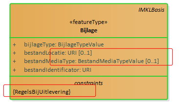

Data content en structuur
=========================

Dit hoofdstuk beschrijft het datamodel van utiliteitsnetten. Aan de hand van UML
klasse diagrammen wordt het model beschreven.

Inleiding.
----------

In de volgende paragrafen wordt de inhoud en structuur van het IMKL beschreven
middels UML diagrammen en een bijbehorende objectcatalogus.

De verschillende uitwisselprocessen WIBON, Buisleidingen voor Risicoregister en
Stedelijk water worden in aparte paragrafen behandeld. Dit resulteert in vier
deelmodellen respectievelijk benoemd als: IMKL – WIBON;

IMKL – Buisleidingen Risicoregister;

IMKL – Stedelijk water.

De WIBON toepassing wordt als eerste beschreven. Omdat de andere toepassingen
ook delen daarvan gebruiken is het nodig om dit model integraal door te nemen.

Het eerste gedeelte van dit hoofdstuk bevat de UML diagrammen van alle
deelmodellen. Schematisch is opgenomen wat de informatie-inhoud is middels
objecten, hun attributen, datatypen, relaties tussen objecten met alle detail
dat nodig is voor een eenduidige beschrijving. Van elk deelmodel is een compleet
diagram opgenomen waarna in verschillende subparagrafen elke keer een deel in
een apart diagram wordt toegelicht. Sommige onderwerpen hebben een aparte
toelichting nodig deze worden in de titel aangeduid met ‘Extra toelichting’.

Het tweede gedeelte bevat de objectcatalogus met in tabelvorm dezelfde
informatie als de diagrammen maar nu middels taal beschreven. Alle
informatie-elementen zijn daarbij voorzien van definities en indien nodig een
toelichtende beschrijving. De objectcatalogus bevat de gezamenlijke
informatie-inhoud van alle deelmodellen.

UML diagrammen.
---------------

### Beschrijving algemeen principe: IMKL als extensie op INSPIRE.

#### IMKL is gemodelleerd als een extensie op het model voor het INSPIRE thema Utility and Governmental Services. Binnen dat INSPIRE thema zijn alleen de modellen voor utiliteitsnetten (utility networks) van belang voor IMKL. IMKL neemt de hele inhoud over van de INSPIRE specificatie en voegt daar de specifieke informatie aan toe die nodig is voor realisatie van de in de scope genoemde processen. Met IMKL kan daardoor een dataset geleverd worden of dataservice worden ingericht die INSPIRE conform is en voorziet in het detail van de eisen van de genoemde processen. Er is hierbij opgemerkt dat IMKL als een modelmatige extensie van de INSPIRE niet betekent dat de in IMKL geleverde data automatisch INSPIRE data zijn. Dit geldt zeker voor thema’s die niet INSPIRE-plichtig zijn.

Het volgende diagram geeft de relatie tussen de verschillende modellen. IMKL is
een uitbreiding op het INSPIRE Utility Networks model waarin voor de netten
elektriciteit, olie-gas-chemicalien, afvalwater, telecomunicatie, warmte en
drinkwater aparte modellen zijn opgenomen. Deze modellen zijn toepassingen van
het INSPIRE netwerkmodel waarin opgenomen een model voor topologie. Het
netwerkmodel is onderdeel van het INSPIRE Generic Conceptual Model,
basismodellen en basistypen die generiek zijn voor alle INSPIRE thema modellen.
IMKL is een apart pakket met bijbehorende namespace dat gebruik maakt van de
door INSPIRE beheerde pakketten. Een namespace is daarbij gedefinieerd als een
unieke aanduiding voor het domein waarbinnen de informatie-elementen
gedefinieerd zijn. In IMKL zijn afspraken gemaakt over te gebruiken namespaces
en afkortingen hiervoor. De namespace voor IMKL is ‘IMKL’.

#### [./media/image1.wmf](./media/image1.wmf)

#### Figuur 5.1: Een UML package diagram van de relatie tussen IMKL en de INSPIRE dataspecificaties. Elk pakket bevat de informatie die op dat niveau wordt toegevoegd. Het pakket IMKL is een extensie op het INSPIRE model voor Utility Networks. INSPIRE utilities heeft afhankelijkheden met het INSPIRE algemene netwerkmodel en INSPIRE basistypen. IMKL omvat het totaal van de aan elkaar gerelateerde pakketten.

### Metamodel.

IMKL gebruikt voor het beschrijven van de uitbreiding op INSPIRE het zelfde
metamodel voor UML als INSPIRE: het metamodel beschreven in het INSPIRE Generic
Conceptual Model. IMKL wijkt hiermee af van de Nederlandse Standaard voor
informatiemodellering MIM.

De volgende argumenten ondersteunen de keuze voor het INSPIRE metamodel:

\- IMKL is als extensie gemodelleerd op het INSPIRE model. De combinatie van
twee metamodellen maakt de beschrijving van de extensie onnodig complex;

\- Het metamodel van INSPIRE kunnen we niet aanpassen omdat dit in Europees
verband is vastgesteld.

#### De volgende stereotypen worden gebruikt als onderdeel van het UML profiel.

| **Stereotype**    | **Model element**           | **Beschrijving**                                                                                                               |
|-------------------|-----------------------------|--------------------------------------------------------------------------------------------------------------------------------|
| applicationSchema | Package                     | Een applicatie schema volgens ISO 19109 en NEN 3610.                                                                           |
| featureType       | Class                       | Een geografisch object.                                                                                                        |
| dataType          | Class                       | Een gestructureerd data type zonder identiteit.                                                                                |
| union             | Class                       | Een gestructureerd data type zonder identiteit waarvan precies één van de attributen aanwezig is in een instantie.             |
| enumeration       | Class                       | Gesloten lijst van domeinwaarden.                                                                                              |
| codeList          | Class                       | Open lijst van domeinwaarden                                                                                                   |
| voidable          | Attribute, association role | Om aan te geven dat het attribuut of associatierol een nullwaarde kan hebben. Een reden waarom het attribuut niet ingevuld is. |

### UML - WIBON overzicht.

Het onderstaand UML diagram bevat het complete IMKL – WIBON inclusief de relatie
met INSPIRE Utilities. In de hierop volgende paragrafen wordt telkens een deel
van het diagram toegelicht.

Kleurgebruik in diagrammen:

-   Oranje: IMKL objecttypen.

-   Rood: INSPIRE Utility Networks per type kabel of leiding

-   Groen en grijs: INSPIRE Utility Networks algemeen

-   Licht oranje en grijs: Niet-instantieerbare objecttypen, datatypen en
    waardelijsten.

-   In de diagrammen zijn de wijzigingen ten opzichte van de IMKL 1.2.1 versie
    met rode kaders aangegeven.

Voorbeeld: cardinaliteit aangepast en constraint toegevoegd:

Voor WIBON geldt dat er een verschil is tussen het dataverkeer tussen de
centrale voorziening en de afnemers, de uitlevering, en het dataverkeer tussen
de netbeheerders en de centrale voorziening, de aanlevering. Bij de
netbeheerders geldt vervolgens dat er een verschil is tussen de centraal
aangesloten netbeheerders en de decentraal aangesloten netbeheerders. Deze
verschillende zijn in de diagrammen aangegeven.

-   Rood omlijnd: gegevens die door de centrale voorziening worden gegenereerd.
    Komen alleen voor in uitlevering.

-   Groen omlijnd: gegevens die voor de centraal aangesloten netbeheerder door
    de voorziening wordt gegenereerd. Decentraal aangesloten netbeheerders
    moeten deze gegevens per melding aan de centrale voorziening leveren.

-   Bij objecttypen is met constraints aangegeven indien er verschil is met
    betrekking tot aan- of uitlevering of een decentraal of centraal aangesloten
    netbeheerder.

Toelichting bij het diagram.
